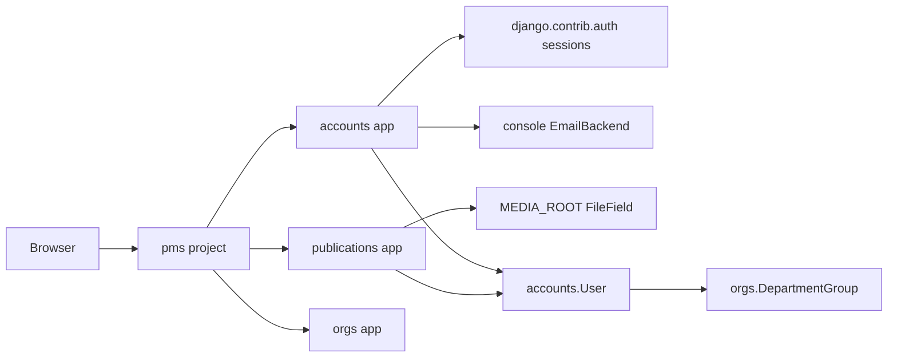

# Implementation Plan — Publications Management System (PMS)

This document describes how the Django stubs in this repository will be turned into a working system for UC-01–UC-07. It is not an implementation. Current code is placeholder-only: views render stub templates; services raise `NotImplementedError`; `require_role` allows every request.

**Stack:** Python, Django 5.2, SQLite (dev), pytest-django.  
**Run (after a virtualenv is active):** `pip install -r requirements.txt`, `python manage.py migrate`, `python manage.py runserver`.

## Architecture

| App | Responsibility |
|---|---|
| `pms` | Settings, root URLconf, SQLite, static/media, console email |
| `accounts` | UC-01, UC-02, UC-06: custom `User`, confirmation tokens, login/logout, VUB network-mode middleware |
| `publications` | UC-03, UC-04, UC-05: search, download, publisher-owned publications |
| `orgs` | UC-07: `DepartmentGroup` (not `django.contrib.auth.Group`) |

Cross-cutting NFRs from Part 1 (N01–N03) are not separate use cases. They constrain password hashing (Django `PBKDF2PasswordHasher`), HTTPS in deployment, and error handling on file/search failures.

## Role hierarchy

SRS six-level inheritance (each higher role includes functions of the one below):

Guest → VUB-Network User → Member → Publisher → Moderator → Administrator

| Role | Intended capabilities (when authorization is implemented) |
|---|---|
| Guest | Register, log in, confirm account |
| VUB-Network User | Search, download (no account required when network mode is on) |
| Member | Authenticated session at Member level |
| Publisher | Upload / view / edit **own** publications (no delete) |
| Moderator | User search/edit within own department (Member ↔ Publisher only) |
| Administrator | User create/delete, any role; group CRUD |

`accounts.permissions.require_role` will enforce this. Until then it is a documented no-op.

## Model and URL mapping

| Use case | Models | Routes |
|---|---|---|
| UC-01 Register | `User`, `ConfirmationToken` | `/register/`, `/confirm/` |
| UC-02 Auth / network | `User` + session | `/login/`, `/logout/`, `/network-mode/` |
| UC-03 Search | `Publication` | `/search/` |
| UC-04 Download | `Publication.file` | `/publications/<id>/download/`, `/search/download-all/` |
| UC-05 Own publications | `Publication.owner` | `/publications/upload/`, `/publications/mine/`, `/publications/<id>/edit/` |
| UC-06 User accounts | `User` | `/users/`, `/users/create/`, `/users/<id>/edit/`, `/users/<id>/delete/` |
| UC-07 Groups | `DepartmentGroup` | `/groups/`, `/groups/create/`, `/groups/<id>/edit/`, `/groups/<id>/delete/` |

`AUTH_USER_MODEL = "accounts.User"` is already set so the first migration can include the custom user.

## Design decisions (from UseCase.md)

- **Confirmation (UC-01):** token shown on-screen and/or logged via Django console `EmailBackend`; no SMTP in development.
- **VUB network (UC-02):** explicit “network mode” on `/network-mode/` stored in the session; not IP detection. Middleware already exposes `request.vub_network_mode`. Later replaceable with `REMOTE_ADDR` allow-list without changing the use-case outcome.
- **Search (UC-03):** baseline substring match via ORM `filter` / `Q`; true AND/OR/NOT parsing is an unsupported SRS point to defend at demo. Pagination via Django `Paginator`.
- **Bulk download (UC-04):** `.zip` via Python `zipfile`, streamed with `FileResponse`. Single files pdf/ps through `FileField` / `MEDIA_ROOT`.
- **Publisher delete (UC-05):** no “delete own publication” control; deletion starts at Moderator (out of R05 scope).
- **User admin (UC-06):** custom views/forms over `accounts.User`, not the stock Django admin as the product UI. Moderators cannot set Administrator or edit outside their department.
- **Groups (UC-07):** dedicated `DepartmentGroup`. Delete must run a live `members.count()` / `exists()` check at deletion time, not a cached empty flag.
- **Passwords:** never stored in plain text; use Django hashers only.

## Open issues to freeze before coding the real flows

| Issue | Proposed default |
|---|---|
| Confirmation token TTL (SRS silent) | 24 hours; max 5 confirmation attempts |
| Session timeout (SRS silent) | Django default session cookie age unless the team shortens it |
| Moderator department boundary | A Moderator may only search/edit users whose `department` equals the Moderator’s `department` |
| Recreating a deleted group with the same name | New empty group; previous permission settings are not restored (out of SRS scope) |
| Max publication file size (SRS TBD) | No hard limit in v1; rely on server/upload settings |

## Implementation phases (later)

1. **Auth and registration** — persist register/confirm; hash passwords; block unconfirmed and locked accounts on login; write network-mode session flag; notify admin via console email.
2. **Search and download** — substring search, ordering, pagination, “no results” message, single-file stream, zip of selected files, missing-file error.
3. **Publisher CRUD** — upload with `request.FILES`; stub then real bibliographic extraction; my-publications list; edit with ownership check; no publisher delete.
4. **User and group admin** — unique username/group name; Moderator vs Administrator rules; refuse delete of non-empty groups with a live membership query.
5. **Tests and NFRs** — pytest-django for each UC main success scenario and listed extensions; document HTTPS for production.

**Later packages (not installed yet):** PDF/BibTeX/RIS extractors such as `pypdf`, `bibtexparser`, or `RISparser` when UC-05 extraction is implemented.

## Test strategy (pytest-django)

`pytest.ini` already sets `DJANGO_SETTINGS_MODULE = pms.settings`. Suggested tests per use case (happy path + extensions from UseCase.md):

| UC | Happy path | Extensions |
|---|---|---|
| UC-01 | Register creates unconfirmed user + token; confirm activates Member | Missing fields; duplicate username; expired token; invalid token retries |
| UC-02 | Login session at stored role; logout destroys session; network mode without login | Bad credentials (generic message); unconfirmed; locked; unknown network mode → Guest |
| UC-03 | Results show title + main author; empty query handled | Invalid syntax; no-results message; ordering/pagination |
| UC-04 | Single file streamed unmodified; zip of several | Abstract-only (no file); storage error logged |
| UC-05 | Upload stores owner; edit own metadata; my list | Unsupported format; extraction fallback to manual form; refuse edit of others; no delete UI for Publisher |
| UC-06 | Admin create/search/edit/delete; Moderator edit in department | Duplicate username; Moderator out-of-department; Moderator cannot grant Administrator |
| UC-07 | Create unique group; edit membership; delete when empty | Duplicate name; missing name; refuse delete when `members.exists()` |

Use Django `Client` / `RequestFactory`, temporary `MEDIA_ROOT`, and fixtures for each role. Do not test Django’s hasher internals; assert that stored passwords are not plaintext.
