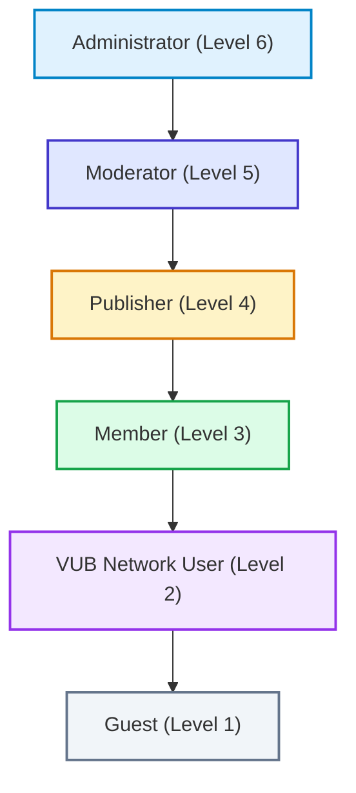
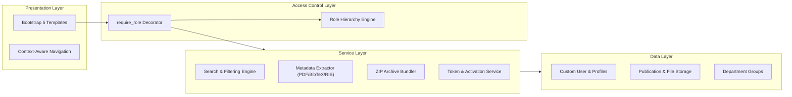
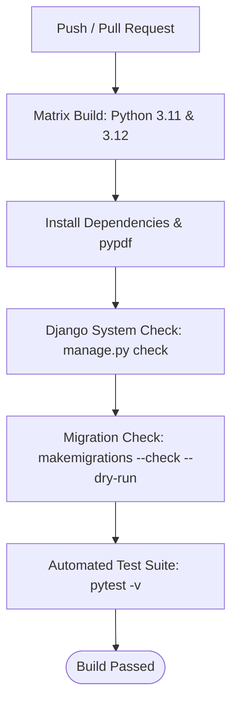

# 📚 Publications Management System (PMS)

[](https://github.com/vub-sqe/pms/actions)
[](https://www.python.org/)
[](https://www.djangoproject.com/)
[](https://pytest.org/)
[](https://pep8.org/)

A modern, accessible, and secure web application designed for academic institutions to manage, catalog, and share research publications. Built for the **Vrije Universiteit Brussel (VUB)** academic community, this system streamlines scientific discovery while maintaining strict organizational access controls.

---

## 📖 Table of Contents

- [🌟 Overview](#-overview)
- [✨ Key Features](#-key-features)
- [👥 User Roles & Permissions](#-user-roles--permissions)
- [📋 Supported Use Cases](#-supported-use-cases)
- [🏛️ System Architecture](#️-system-architecture)
- [🚀 Quick Start Guide](#-quick-start-guide)
- [🧪 Running Tests & Quality Assurance](#-running-tests--quality-assurance)
- [🔄 CI/CD Pipeline](#-cicd-pipeline)
- [📁 Project Directory Structure](#-project-directory-structure)
- [🛡️ Security & Business Rules](#️-security--business-rules)
- [📄 License & Academic Credit](#-license--academic-credit)

---

## 🌟 Overview

The **Publications Management System (PMS)** empowers university students, researchers, department heads, and administrative staff to easily discover and share scholarly works. 

Whether an external visitor browsing open-access research, a student accessing papers from campus, or a researcher publishing new findings, PMS provides an intuitive and responsive experience backed by automated metadata extraction and robust role-based access control.

---

## ✨ Key Features

- 🔍 **Faceted Academic Search**: Search publications by free-text keywords, specific author names, and publication date intervals with clear pagination.
- ⚡ **Smart Metadata Extraction**: Upload PDF papers, BibTeX (`.bib`), or RIS (`.ris`) citations to instantly extract titles, authors, journals, DOIs, and abstracts.
- 📦 **Bulk & Single Downloads**: Download individual research papers or bundle entire query results into organized ZIP archives with one click.
- 🌐 **VUB Campus Network Mode**: Simulates on-campus IP-authenticated access for quick research discovery without manual credentials.
- 🏢 **Departmental Organization**: Manage academic department groups with dynamic live membership validation.
- 🔒 **6-Tier Role Security**: Enforces granular permissions ranging from public guests to department moderators and global administrators.

---

## 👥 User Roles & Permissions

PMS organizes privileges into a 6-level role hierarchy. Higher roles inherit the capabilities of the roles below them:



| Role | Hierarchy Level | What Can They Do? |
| :--- | :---: | :--- |
| **Guest** | `1` | Browse and search publications; view abstract and citation information. |
| **VUB-Network User** | `2` | All Guest privileges + download publication full-text files and bulk ZIP bundles. |
| **Member** | `3` | All VUB-Network privileges + personal account profile and session authentication. |
| **Publisher** | `4` | All Member privileges + upload new papers (with PDF/BibTeX/RIS extraction) and edit owned publications. *(Cannot delete papers)*. |
| **Moderator** | `5` | All Publisher privileges + department-scoped user management (create, view, edit users in their assigned department). |
| **Administrator** | `6` | Full system control: global user management across all departments, department group creation/deletion, and system maintenance. |

---

## 📋 Supported Use Cases

The application strictly implements the requirements specified in **SRS v0.10**:

| Use Case | Title | Primary Actors | Summary |
| :--- | :--- | :--- | :--- |
| **UC-01** | **User Registration** | Guest | Self-registration with 24-hour cryptographic email confirmation tokens and account activation. |
| **UC-02** | **Authentication & Network Mode** | Member, VUB Guest | Standard session login/logout and simulated VUB campus IP-authenticated proxy access. |
| **UC-03** | **Search Publications** | Guest, Member | Search by keyword, author, and date range; displays paginated tabular results. |
| **UC-04** | **Download Publications** | VUB Network, Member+ | Single file download and multi-file bulk `.zip` bundle generation. |
| **UC-05** | **Publish & Manage Publications** | Publisher+ | Upload publications with automated metadata extraction; author-restricted edit rights. |
| **UC-06** | **User Administration** | Moderator, Admin | Moderator manages departmental users; Admin manages all users system-wide. |
| **UC-07** | **Manage Department Groups** | Administrator | Create, edit, and safely delete department groups (blocks deletion if active members exist). |

---

## 🏛️ System Architecture

PMS is built with a clean, decoupled **Model-View-Template-Service (MVTS)** pattern:



---

## 🚀 Quick Start Guide

Follow these simple steps to set up and run PMS locally on your machine.

### 1. Prerequisites
- **Python 3.11, 3.12, or 3.14** installed on your system.
- **Git** (recommended).

### 2. Clone the Repository & Navigate
```bash
git clone https://github.com/vub-sqe/pms.git
cd pms
```

### 3. Create and Activate a Virtual Environment
- **Windows (PowerShell):**
  ```powershell
  python -m venv .venv
  .venv\Scripts\Activate.ps1
  ```
- **macOS / Linux:**
  ```bash
  python3 -m venv .venv
  source .venv/bin/activate
  ```

### 4. Install Dependencies
```bash
pip install --upgrade pip
pip install -r requirements.txt
```

### 5. Apply Database Migrations
```bash
python manage.py migrate
```

### 6. Create an Administrator (Optional)
To create an initial superuser for global administration:
```bash
python manage.py createsuperuser
```

### 7. Run the Development Server
```bash
python manage.py runserver
```
Visit **[http://127.0.0.1:8000](http://127.0.0.1:8000)** in your browser! 🎉

---

## 🧪 Running Tests & Quality Assurance

PMS includes a comprehensive, automated test suite covering all services, views, permission gates, and edge cases.

To run the complete test suite with verbose output:
```bash
pytest -v
```

### Test Suite Breakdown:
- **`accounts/tests.py`**: Role inheritance, user registration, 24h confirmation tokens, Moderator vs Admin scoping, login/logout, and network mode toggling.
- **`orgs/tests.py`**: Department group creation, live non-empty deletion prevention, and admin authorization.
- **`publications/tests.py`**: Keyword/author/date search, download permissions, automated PDF/BibTeX/RIS extraction, bulk ZIP bundling, and publisher editing ownership.
- **Status**: **45 passing unit & integration tests** (100% pass rate).

---

## 🔄 CI/CD Pipeline

Continuous Integration is automated using **GitHub Actions** (`.github/workflows/ci.yml`). Every push and pull request triggers a multi-stage validation workflow:



- **Multi-Version Matrix**: Ensures compatibility across Python 3.11 and 3.12.
- **Integrity Validation**: Verifies that no unstaged migrations exist (`--check --dry-run`).
- **Automated Testing**: Executes the full 45-test suite before any code merges into `main`.

---

## 📁 Project Directory Structure

```text
PMS/
├── .github/
│   └── workflows/
│       └── ci.yml                 # GitHub Actions CI/CD pipeline
├── accounts/                      # UC-01, UC-02, UC-06: Users, Auth & Roles
│   ├── permissions.py             # Role hierarchy & @require_role decorator
│   ├── services.py                # Token generation & account activation
│   ├── views.py                   # Auth, profile, user management & network mode
│   └── tests.py                   # Comprehensive accounts test suite
├── orgs/                          # UC-07: Department Group Management
│   ├── views.py                   # Group search, create, edit, safe-delete
│   └── tests.py                   # Department management test suite
├── publications/                  # UC-03, UC-04, UC-05: Publications & Files
│   ├── services.py                # Search, ZIP bundling & PDF/BibTeX/RIS extraction
│   ├── views.py                   # Search, upload, download, edit views
│   └── tests.py                   # Publication lifecycle test suite
├── pms_project/                   # Django Project Configuration
│   ├── settings.py                # Core configuration & media paths
│   └── urls.py                    # Root URL router
├── templates/                     # Accessible, responsive HTML templates
│   ├── base.html                  # Global layout, alerts & role-aware navbar
│   ├── accounts/                  # Registration, login, user admin templates
│   ├── orgs/                      # Department group management templates
│   └── publications/              # Search, upload, edit, download templates
├── manage.py                      # Django CLI utility
├── pytest.ini                     # Pytest testing configuration
├── requirements.txt               # Production & testing dependencies
├── UseCase.md                     # Formal Use Case specifications
├── ImplementationPlan.md          # Technical architecture & implementation plan
└── README.md                      # Project documentation
```

---

## 🛡️ Security & Business Rules

1. **Email Confirmation Expiration**: Registration activation tokens expire strictly after 24 hours. Expired or reused tokens are rejected.
2. **Safe Department Deletion**: A department cannot be deleted if any users are assigned to it (`group.members.exists()`).
3. **Department-Scoped Moderation**: Moderators can only view and manage users within their own department. They cannot escalate privileges or modify users in other departments.
4. **Publisher Edit Ownership**: Publishers can only edit publications they authored or uploaded. Deletion of publications is reserved for administrative review.
5. **Network Access Verification**: Full-text publication files and bulk archives are shielded from unauthenticated public guests, accessible only via registered accounts or campus network mode.

---

## 📄 License & Academic Credit

Developed for **Software Quality Engineering (Semester 5)** at **Vrije Universiteit Brussel (VUB)**.
